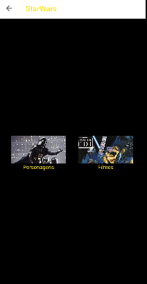
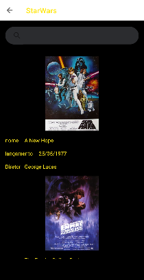
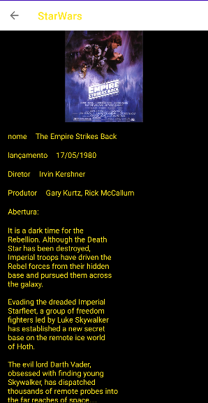

# StarWars
Este é um aplicativo que lista 2 categorias(`People` e `films`) da api https://swapi.dev/api/ 

## Como usar
primeiro você escolhe a categoria desejada,

depois voce escolhe qual item deseja saber mais detalhes,

depois se tem detalhe completo do item selecionado

## Detalhes do desenvolvimento
Arquitetura MVVM
* Android Studio Dolphin | 2021.3.1
* Minimum SDK version 23
* Compile SDK version 33 
* TargetSdk 31
* Kotlin version 1.8

## Dependencias

* [Coroutines][page-coroutine]
* [Koin][page-koin]
* [Retrofit][page-retrofit]
* [Gson][page-gson]
* [Junit][page-junit]
* [Mockito][page-mockito]
* [Navigation] [page-navigation]
* [Picasso] [page-picasso]

[page-coroutine]: https://github.com/Kotlin/kotlinx.coroutines
[page-koin]: https://insert-koin.io/
[page-retrofit]: https://square.github.io/retrofit/
[page-gson]: https://github.com/google/gson
[page-junit]: https://developer.android.com/training/testing/junit-rules
[page-navigation]: https://developer.android.com/guide/navigation?gclid=CjwKCAjw_YShBhAiEiwAMomsEDGJwN7DBDxOQWdwsTz7FKjoOfomM8bbizEBuaMn9rzKRj_2zNILPRoC5QgQAvD_BwE&gclsrc=aw.ds&hl=pt-br
[page-picasso]: https://square.github.io/picasso/
